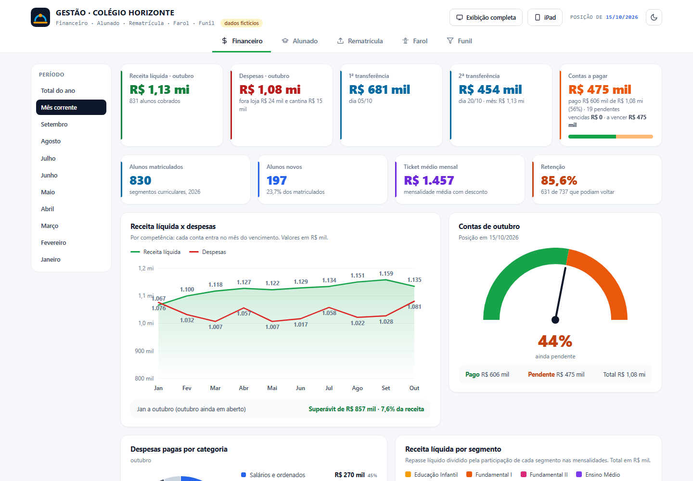
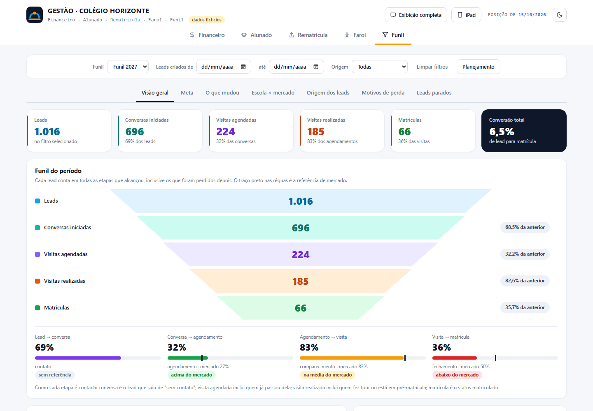
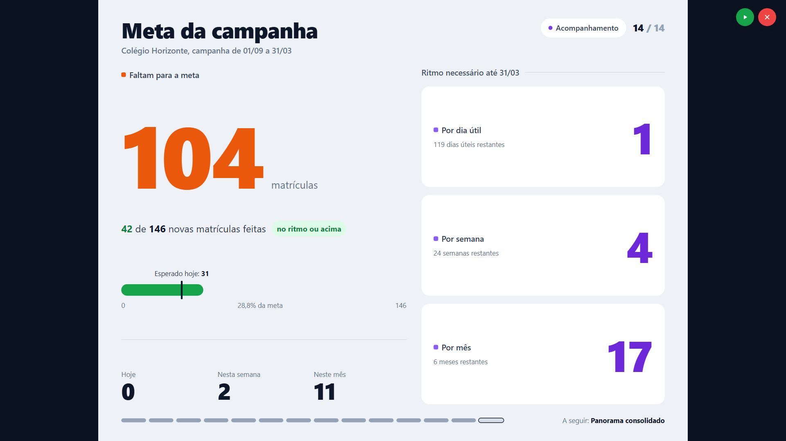
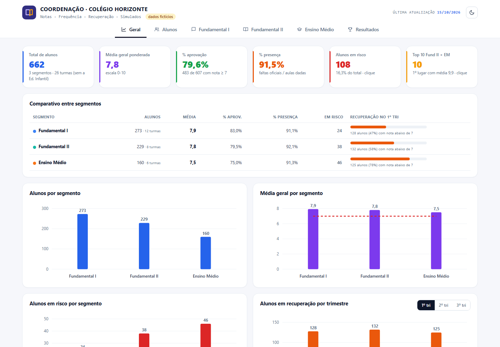
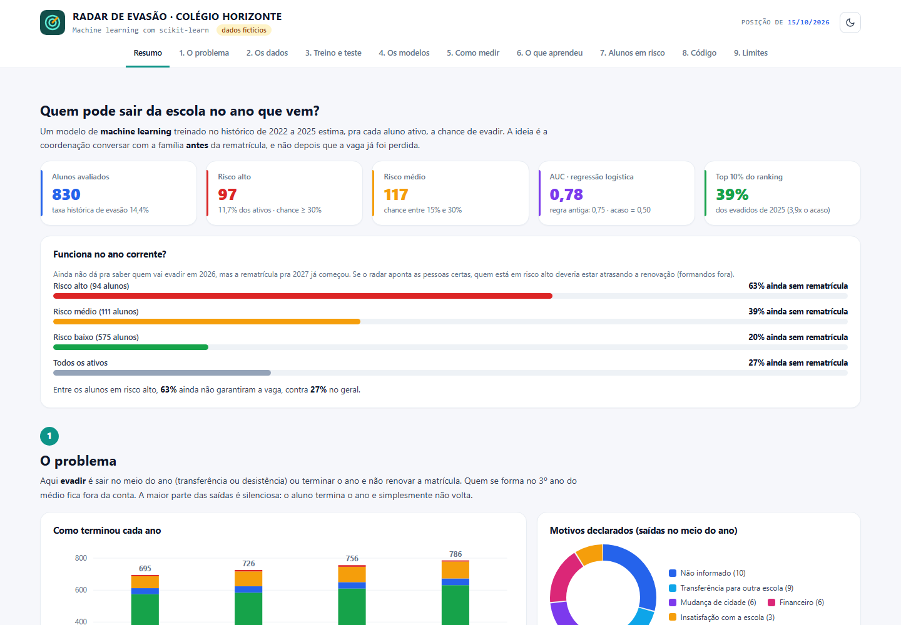
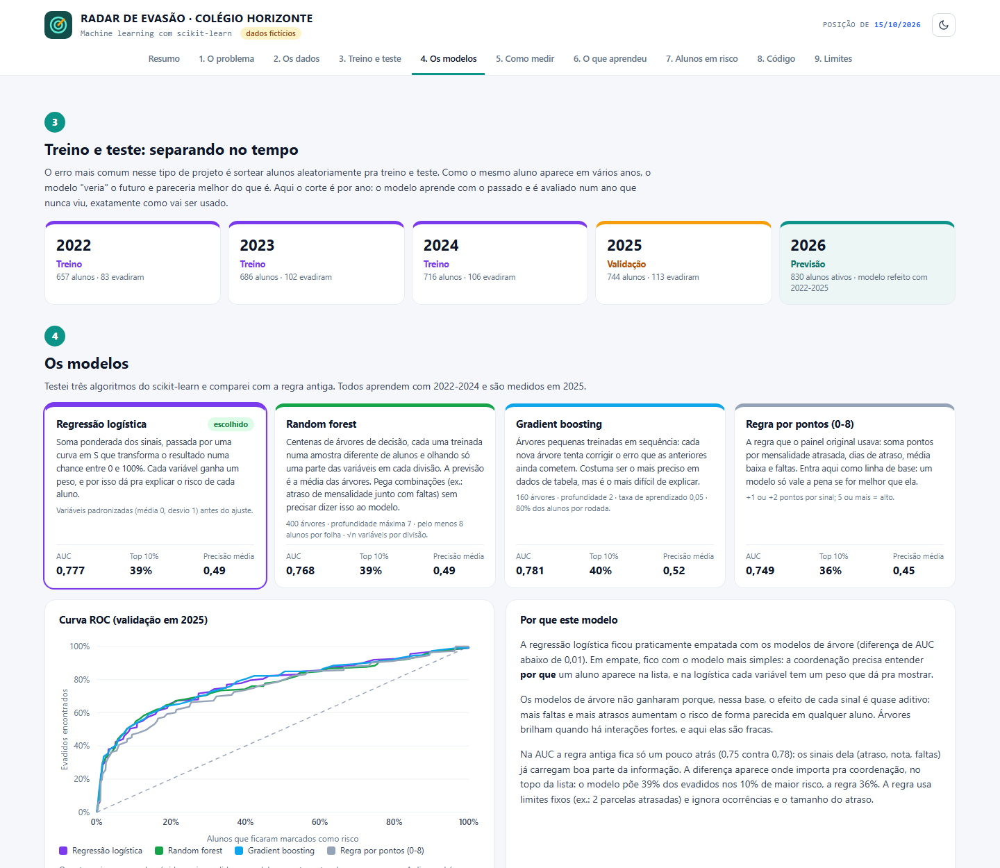

# Painel de gestão escolar

Fiz esses painéis pra escola onde trabalho. A ideia era parar de montar planilha toda semana pra reunião da direção e ter um lugar só com financeiro, matrículas, rematrícula, funil de captação e o acompanhamento pedagógico. Hoje eles rodam todo dia de madrugada num servidor e o de gestão fica aberto numa TV na sala da direção.

Essa é a versão pública. Os dados reais ficaram de fora, então tudo aqui (alunos, valores, fornecedores, bancos) é inventado por um script com seed fixa. As telas e os cálculos são os mesmos da versão que uso no trabalho.

São três páginas independentes:

- **Gestão**: https://7mottz.github.io/dashboard-gestao-escolar/
- **Coordenação pedagógica**: https://7mottz.github.io/dashboard-gestao-escolar/coordenacao.html
- **Radar de evasão** (machine learning): https://7mottz.github.io/dashboard-gestao-escolar/evasao.html



## Gestão

Cinco abas:

- **Financeiro**: receita x despesa, fluxo de caixa com projeção até dezembro, realizado x orçado com drill-down até a conta, empréstimos e calendário de vencimentos.
- **Alunado**: ritmo de matrícula comparado com o ano anterior, novos x veteranos, ocupação das turmas e um mapa de calor de onde os alunos moram.
- **Rematrícula**: quanto da base já renovou e quem ainda não decidiu.
- **Farol**: faturamento projetado x realizado aluno por aluno.
- **Funil**: do lead até a matrícula, com as taxas de cada etapa comparadas com uma referência de mercado e um planejamento que transforma a meta da campanha em metas semanais.

E tem o modo apresentação: 14 slides que ficam girando sozinhos na TV (ou no iPad, nas reuniões).





## Coordenação pedagógica

O painel das coordenadoras: visão geral da escola, classificação dos alunos (ótimo, bom, atenção, risco), uma página por segmento (médias por turma e disciplina, recuperação por trimestre, presença × nota, calendário de presença da catraca, heatmap turma × disciplina) e os resultados de simulados. Clicando em qualquer aluno abre a ficha com notas por trimestre, ocorrências e pareceres.



## Radar de evasão

A versão original usava uma regra por pontos (mensalidade atrasada, faltas, nota baixa). Aqui troquei por machine learning com scikit-learn e deixei a regra como linha de base. A página conta o processo inteiro, do jeito que eu explicaria pra quem não é da área:

- treina com o histórico de 2022 a 2024 e valida em 2025, um ano que o modelo não viu (separar por ano evita o modelo "conhecer o futuro");
- compara regressão logística, random forest, gradient boosting e a regra antiga pela AUC e por quanto dos evadidos aparece no topo do ranking;
- confere a calibração, porque a coordenação lê o número como chance mesmo ("30%" tem que ser uns 3 em cada 10);
- mostra a importância das variáveis de três jeitos (permutação, impureza da random forest e pesos da logística);
- explica cada aluno pelos sinais que mais pesaram (atrasos, faltas, ocorrências...).

Na base fictícia os três modelos ficam com AUC entre 0,77 e 0,78; no empate fiquei com a logística, que dá pra explicar pra coordenação. O resultado mais interessante foi outro: a regra antiga, com só quatro sinais, chega a 0,75. Quando os sinais que importam já estão na regra, o modelo não faz milagre. O ganho dele está em ordenar melhor a lista (nos 10% de maior risco ele acha 39% de quem saiu, a regra 36%), em dar uma chance calibrada em vez de uma pontuação e em explicar cada caso. Dos alunos que o modelo marca como risco alto, uns 63% ainda não rematricularam pro ano seguinte, contra 27% no geral.

Uma ressalva honesta: os dados são sintéticos. O gerador esconde um "risco" em cada aluno que piora um pouco nota, frequência, ocorrências e pagamento, e o modelo tem que achar esse sinal sozinho. Serve pra mostrar o processo (separação temporal, comparação com baseline, calibração), não pra provar que esses números valem pra uma escola de verdade.





## Como roda

Precisa de Python 3.9+. Quase tudo usa só a biblioteca padrão; o radar de evasão precisa do scikit-learn:

```
pip install -r requirements.txt
python build.py
```

Depois é só abrir `docs/index.html` (gestão), `docs/coordenacao.html` ou `docs/evasao.html`. Com `#apresentacao` no fim do endereço a gestão já abre nos slides.

O build tem três passos: `gerar_dados.py` cria a base fictícia (no trabalho isso é a extração do ERP e do CRM), `pipeline/agregar.py` calcula os números (e treina o modelo de evasão) e `pipeline/gerar_html.py` monta as três páginas, cada uma num HTML só dentro de `docs/`. O front fica em `src/`, um arquivo JS por aba.

## Umas escolhas que fiz

Não usei biblioteca de gráfico. Começou porque eu queria as barras hachuradas nos meses projetados e não achei um jeito simples de fazer isso, aí acabei fazendo tudo em SVG na mão. Deu mais trabalho, mas o arquivo final abre offline e eu controlo cada detalhe.

A apresentação é desenhada num tamanho fixo (2048x1536) e escalada pra tela. Tentei fazer responsivo antes e cada TV quebrava as linhas de um jeito diferente.

Dados de aluno são sensíveis, então a versão pública já nasce sem nada disso: nenhum dado de saúde (nem inventado), e o radar só usa indicadores que a escola já acompanha pra outras coisas. Todas as notas ficam na escala de 0 a 10; no original cada tela usava uma escala.

Nos meses que ainda não fecharam, a despesa usa o orçamento, que lá na escola é um teto de gasto e não uma previsão. Por isso novembro e dezembro parecem pessimistas: é de propósito.

## Limitações

- O mapa de calor puxa o Leaflet de um CDN, então precisa de internet. O resto funciona offline.
- O planejamento do funil fica salvo no navegador. Na versão do trabalho ele é compartilhado por um backend simples, que não entrou aqui.
- No celular dá pra usar, mas o painel foi pensado pra tela grande.
